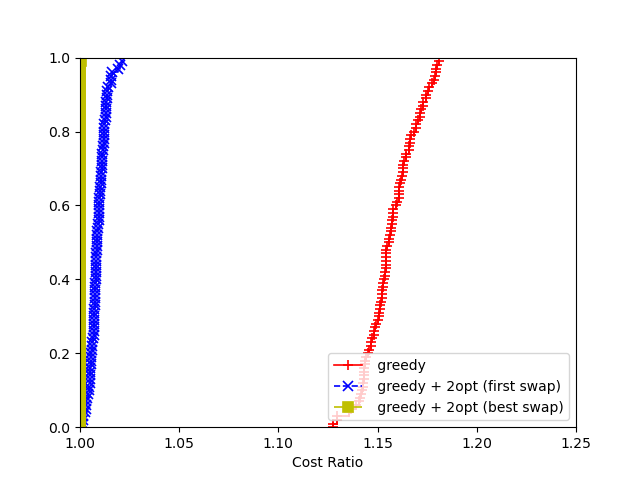

# TSP OR2 UNIVERSITY PROJECT
University project for the OR2 course.  

## HOW TO:

### Build and run the project
*Make sure that you have installed cplex and edit the paths accordingly in the Makefile.*  

Open terminal in this folder.  

#### Compile in Linux / MacOS
Edit the Makefile: write MAC in the OS variable if you're on a MacOS, anything else if you're in Linux.
```shell
OS = MAC (for MacOS)
OS = Linux (for Linux)
...
```
To compile write in the terminal:
```shell
make
```

#### Compile in Windows (mingw32 compiler)
To compile just type in the terminal:
```shell
mingw32-make -f Makefile_win
```

#### Run the project

```shell
./tsp <options>
```

### Command line options 

To view the command line options, after building the project, use 
```shell
./tsp -help
```

### Run multiple tests (performance profiler)
First create a file inside the ./plotting folder (the name is irrelevant).  
```shell
touch ./plotting/test_run
```
Write in this file the run in the following format:
```shell
number_of_instances : <common parameters>
algorithm_name <algorithm parameters> : <description to be shown on the performance profiler>
algorithm_name <algorithm parameters> : <description to be shown on the performance profiler>
algorithm_name <algorithm parameters> : <description to be shown on the performance profiler>
...
```

Then to run this command, navigate to the base folder and write:
```shell
python3 pp_autom.py ./plotting/test_run
```

#### Example:  

_plotting/test_run_:
```shell
100 : -tl 120 -nodes 1000
greedy : greedy
g2opt : greedy + 2opt (first swap)
g2opt-best : greedy + 2opt (best swap)
```

_terminal command_:  
```shell
python3 pp_autom.py ./plotting/test_run
```

This command will run 100 (random) instances of 1000 nodes, using a time limit of 120s.  
The algorithms that will be confronted are the greedy, the g2opt and the g2opt-best.  

The output of this command will be:
<center>
    
</center>

### Plot the solutions
If you don't have gnuplot installed you will see a warning after the execution of the program.  
To plot the solution generated in the ./solutions/ folder:  
```shell
cd plotting
python3 plot_solution.py ../solutions/<your_solution_file>
```

The plot will be saved in the ./plots/ folder.  

### Plot the intermediate costs
If you specified a verbose option >= 500 you can plot the intermediate solutions to see the evolution of the cost:
```shell
cd plotting
python3 plot_cost.py
```

The plot will be shown and saved in the ./plotting/plot.png file.  

### Verbose options
Here is a list of the values:
 - \<0 for quiet                                 (nothing)
 - \[0, 10[ for normal                           (basic info for final user)
 - \== 5 for thread info                         (multithreading)
 - \>=10 for new best solutions                  (visual info)
 - \>=50 to plot intermediate costs              (plotting)
 - \>=100 for integrity checks                   (default, integrity checks enabled) <--- suggested while in development
 - \>=500 to see the path in the solution        (advanced debugging)
 - \>=1000 for super-verbose                     (full verbose)